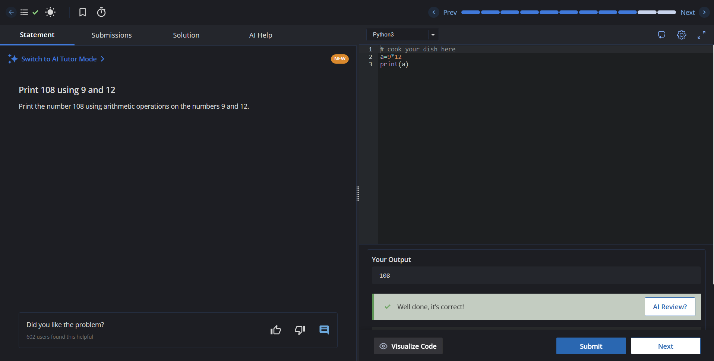

# Task 3: Explore Coding & Collaboration Platforms

**Role:** Student Digital Ambassador
**Module:** 3

## 💻 Part A: Coding Practice (CodeChef)
To build familiarity with coding practice platforms, I completed a beginner-level challenge on CodeChef. 

* **Platform:** CodeChef
* **Challenge Completed:** `[print 108 by using artihematic operations on 9 and 12]`
* **Proof of Completion:** 

---

## 📊 Part B: Google Workspace Collaboration
To practice using cloud collaboration tools, I designed a 5-question 'Digital Literacy Awareness Quiz' intended for my batchmates. It includes both multiple-choice and short-answer formats to test their knowledge on online safety and digital tools.

* **Form Screenshot:** 
  
* **Response Sheet Screenshot:** 

---
*Note: The direct, interactive link to the Google Form is located in the main repository `README.md` file. The full 150-200 word reflection detailing how these platforms support my academic growth is located in the `Project_Report` document inside the `report/` folder.*
